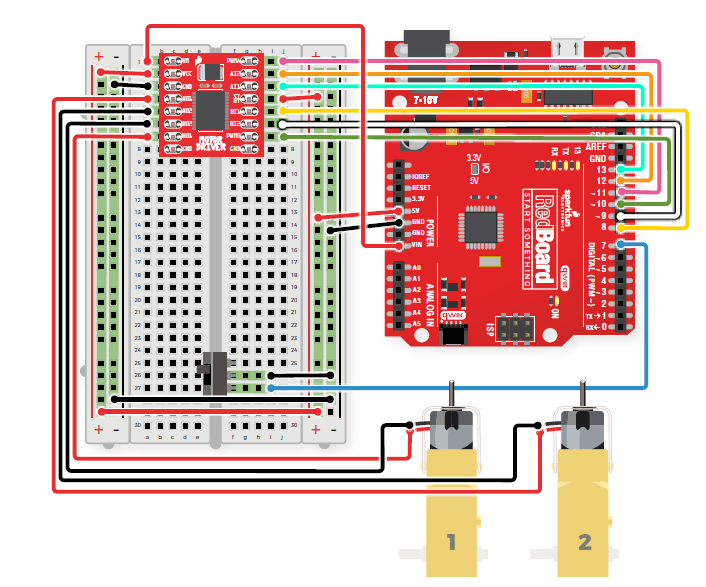

# Rover 1

## Wiring

Here is an overveiw of how the Arduino/Redboard is wired using the motor driver provided in the parts list below.

For a more detailed description of how to wire the redboard you can refer to page 96 of the ["SparkFun Inventor's Kit"](https://github.com/P3-NSF-NRT/P3_Corteva-Phenome2020-Workshop/blob/master/SIK%20v4.1%20Book%202019%20WEB.pdf) manual or the [SparkFun](https://www.sparkfun.com/) website.

## Code

## Body
