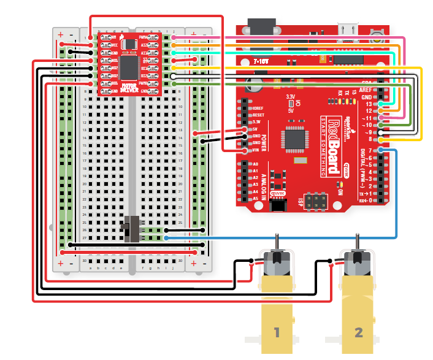

# Rover 2

## Wiring

Here is an overveiw of how the Arduino/Redboard is wired using the motor driver provided in the parts list below.  
This wiring set up is identical to [Rover 1](../P3-Rover-1).



For a more detailed description of how to wire the redboard you can refer to page 96 of the ["SparkFun Inventor's Kit"](https://github.com/P3-NSF-NRT/P3_Corteva-Phenome2020-Workshop/blob/master/SIK%20v4.1%20Book%202019%20WEB.pdf) manual or the [SparkFun](https://www.sparkfun.com/) website.

## Code

The code used for this rover is mainly provided by the example code provided with the Inventor Kit. It is similar to the code used with [Rover 1](../P3-Rover-1) with some modifications to turn the commands into functions that are called. The path given to the robot is continuously executed until the rover is turned off or loses power.

**Note:** Code mentioned here is used with [Arduino IDE](https://www.arduino.cc/en/main/software) which can be used online or through a program downloaded to a computer. **This is not Python or R code, it is Arduino IDE code**

[Rover 2 Code](Rover_2.ino)

```
/* 
This sketch was adapted from Circuit 5B - Remote Control Robot activity in the SparkFun Guide to Arduino.
Check out the rest of the book at
https://www.sparkfun.com/products/14326

This code was modified by Ashlyn Rairdin to allow the user to supply a series of commands
to a set of 2 motors to be executed continuously until the robot is turned off or loses power
 */

//the right motor will be controlled by the motor A pins on the motor driver
const int AIN1 = 13;           //control pin 1 on the motor driver for the right motor
const int AIN2 = 12;            //control pin 2 on the motor driver for the right motor
const int PWMA = 11;            //speed control pin on the motor driver for the right motor

//the left motor will be controlled by the motor B pins on the motor driver
const int PWMB = 10;           //speed control pin on the motor driver for the left motor
const int BIN2 = 9;           //control pin 2 on the motor driver for the left motor
const int BIN1 = 8;           //control pin 1 on the motor driver for the left motor

int switchPin = 7;             //switch to turn the robot on and off

const int driveTime = 60;     //this is the number of milliseconds that it takes the robot to drive 1 inch (or unit of choice)
                              //you can modify this number to 'calibrate' the motors to go about 1 inch when fed a value of 1
                              //The greater the number the longer the motors run, so if the robot does not move far enough increase
                              //this value, and if it goes too far decrease this number
                              
const int rightturnTime = 5.3;   //this is the number of milliseconds that it takes to turn the robot 1 degree to the right
                                 //you can modify this number to 'calibrate' the motors to go about 1 degree when fed a value of 1
                                 //The greater the number the longer the motors run, so if the robot does not move far enough increase
                                 //this value, and if it goes too far decrease this number

const int leftturnTime = 6;    //This is the same as the rightturnTime but for turning left
                               //There are two values because it allows the user to more accurately 'calibrate' the robot
                               //The same could be done for forwards and backwards if necessary
                               
                               //Note: these numbers will vary a little bit based on how you mount your motors, the friction of the
                               //surface that your driving on, and fluctuations in the power to the motors.
                               //You can change the driveTime and turnTime to make them more accurate

void setup()
{
  pinMode(switchPin, INPUT_PULLUP);   //set this as a pullup to sense whether the switch is flipped

  //set the motor contro pins as outputs
  pinMode(AIN1, OUTPUT);
  pinMode(AIN2, OUTPUT);
  pinMode(PWMA, OUTPUT);

  pinMode(BIN1, OUTPUT);
  pinMode(BIN2, OUTPUT);
  pinMode(PWMB, OUTPUT);
}
void rightMotor(int motorSpeed)                       //function for driving the right motor
{
  if (motorSpeed > 0)                                 //if the motor should drive forward (positive speed)
  {
    digitalWrite(AIN1, LOW);                         //set pin 1 to high
    digitalWrite(AIN2, HIGH);                          //set pin 2 to low
  }
  else if (motorSpeed < 0)                            //if the motor should drive backwar (negative speed)
  {
    digitalWrite(AIN1, HIGH);                          //set pin 1 to low
    digitalWrite(AIN2, LOW);                         //set pin 2 to high
  }
  else                                                //if the motor should stop
  {
    digitalWrite(AIN1, LOW);                          //set pin 1 to low
    digitalWrite(AIN2, LOW);                          //set pin 2 to low
  }
  analogWrite(PWMA, abs(motorSpeed));                 //now that the motor direction is set, drive it at the entered speed
}

/********************************************************************************/
void leftMotor(int motorSpeed)                        //function for driving the left motor
{
  if (motorSpeed > 0)                                 //if the motor should drive forward (positive speed)
  {
    digitalWrite(BIN1, HIGH);                         //set pin 1 to high
    digitalWrite(BIN2, LOW);                          //set pin 2 to low
  }
  else if (motorSpeed < 0)                            //if the motor should drive backwar (negative speed)
  {
    digitalWrite(BIN1, LOW);                          //set pin 1 to low
    digitalWrite(BIN2, HIGH);                         //set pin 2 to high
  }
  else                                                //if the motor should stop
  {
    digitalWrite(BIN1, LOW);                          //set pin 1 to low
    digitalWrite(BIN2, LOW);                          //set pin 2 to low
  }
  analogWrite(PWMB, abs(motorSpeed));                 //now that the motor direction is set, drive it at the entered speed
}
void turnright(int dist){
  rightMotor(-200);                                //drive the right wheel forward
  leftMotor(255);                                 //drive the left wheel forward
  delay(rightturnTime * dist);            //drive the motors long enough travel the entered distance
  rightMotor(0);                                  //turn the right motor off
  leftMotor(0);                                   //turn the left motor off
  delay(500);
}
void turnleft(int dist){
  rightMotor(255);                               //drive the right wheel forward
  leftMotor(-200);                                //drive the left wheel forward
  delay(leftturnTime * dist);            //drive the motors long enough travel the entered distance
  rightMotor(0);                                  //turn the right motor off
  leftMotor(0);                                   //turn the left motor off
  delay(500);
}
void forward(int dist){
  rightMotor(200);                               //drive the right wheel forward
  leftMotor(200);                                //drive the left wheel forward
  delay(driveTime * dist);            //drive the motors long enough travel the entered distance
  rightMotor(0);                                  //turn the right motor off
  leftMotor(0);                                   //turn the left motor off
  delay(500);
}
void reverse(int dist){
  rightMotor(-200);                               //drive the right wheel forward
  leftMotor(-200);                                //drive the left wheel forward
  delay(driveTime * dist);            //drive the motors long enough travel the entered distance
  rightMotor(0);                                  //turn the right motor off
  leftMotor(0);                                   //turn the left motor off
  delay(500);
}

void loop() {
  // put your main code here, to run repeatedly:
  while(digitalRead(7) == LOW)                //while the switch is in the ON position
  {                                                                     
     //Place directions for rover here
     //Example: drive forward 10 inches, turn left 90 degrees, drive forward 10 inches, turn right 90 degrees, reverse 20 inches
     //You can also change the delay time between each command
     forward(10);
     delay(1000);
     turnleft(90);
     delay(1000);
     forward(10);
     delay(1000);
     turnright(90);
     delay(100);
     forward(10);
     delay(1000);
     reverse(20);
     delay(5000); 
  }
  rightMotor(0);                                  //turn the right motor off
  leftMotor(0);                                     //turn the left motor off  
  
}
/********************************************************************************/
```

## Body

This rover has design intended for demenstration more than use in application in a greenhouse. The main body is made out of poster board and the two tires attached to the motors are listed below. The front tire is a caster wheel picked up from the local hardware store. The reason it has a three wheel design is because having a front fixed axil prevents the car from turning, to have a four wheel design one would need to make a front axil that turns. This is explored more in [Rover 3](../P3-Rover-3).

Here is a simple schematic of the rover used at phenome:  
[Rover 2 Schematic](../Rover_Images/Rover2-Model.pdf)  
Note: The person who drew this is not an engineer and this not an accurate mechanical drawing, it is just simply ment to provide some dimensions and representation of the rover.

## Parts List

Item  | Cost  
------|-------
[RedBoard](https://www.sparkfun.com/products/13975)| 19.95
[Breadboard](https://www.sparkfun.com/products/12002) | 4.95
[Basic Motor Driver](https://www.sparkfun.com/products/14450) | 5.45
[Tires](https://www.sparkfun.com/products/13259) | 2.95
[Switch](https://www.sparkfun.com/products/102)|1.50
[Basic Motors](https://www.sparkfun.com/products/13302)|4.11
[USB Cable for RedBoard](https://www.sparkfun.com/products/11301) | 5.10
[Wires](https://www.sparkfun.com/products/11026)|2.25
[9V Battery Pack](https://www.sparkfun.com/products/10512)| 2.95
