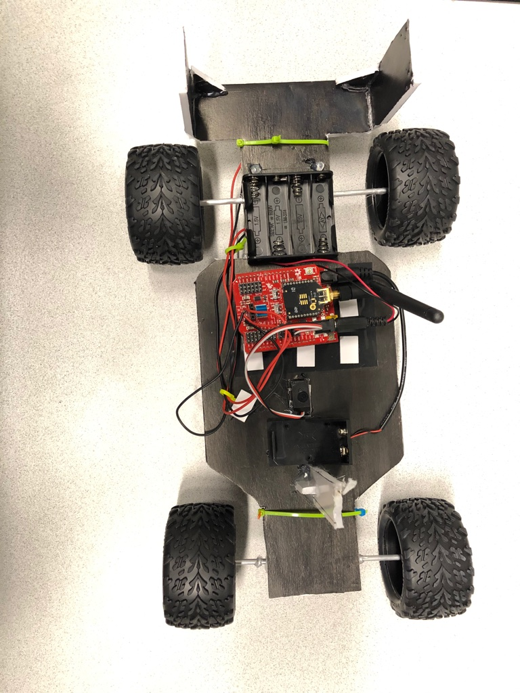
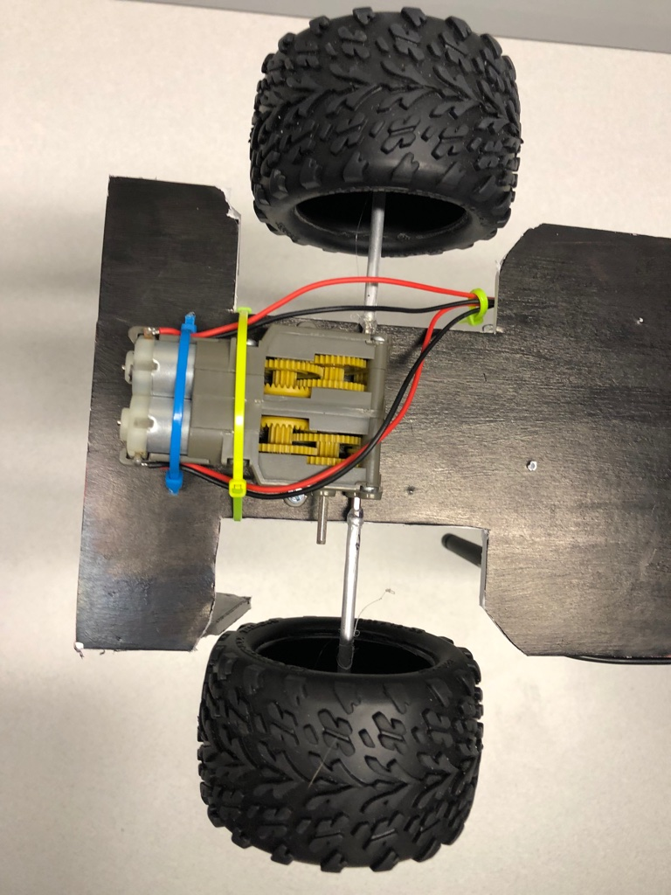

# Rover 3


This section covers a more advanced rover. This rover takes a similar concept from [Rover 1](../P3-Rover-1) and [Rover 2](../P3-Rover-2) in using arduino board and two motors to control a small rover. This project takes it a step further by adding a servo and wireless control. It is highly suggested to look at the linked SparkFun guides. These were heavily used for help in coding but some modifications were made to fit our project. It is also suggested to have some knowledge in how to solder, install drivers on a computer and troubleshoot. There are many components to this rover which leads to many possible errors when things are not working. Now let's dig into the details!

## Wiring

The wiring for this project involves the two main components, the controller and the Arduino controlling the motors. Below there are some guides listed with how to assemble/hookup these things. There is also a component mentioned called an XBee Module and this is not a part that required wiring but it is attached to both components to make the setup wireless. These XBee modules need to be configured and SparkFun has some [guides](https://learn.sparkfun.com/tutorials/exploring-xbees-and-xctu?_ga=2.60464681.545162938.1581579323-794898768.1581579323) about how to do this but it is highly suggested to read through the other guides first to make sure you configure the XBees correctly.

Note: [SparkFun](https://www.sparkfun.com/) provides a lot of guides that were very helpful when I ran into problems. They have guides to help install the drivers necessary to run all to parts of this project you just make have to look for some. I found most of them were linked or related in the hookup guides. 

#### Wireless Controller

The wireless controller we used was ordered off [SparkFun](https://www.sparkfun.com/) and they have a [hookup guide](https://learn.sparkfun.com/tutorials/wireless-joystick-hookup-guide) for this product. For this portion of the project some soldering is required. For our rover we also chose the dual joystick design. It is also important to pay attention to the requirements when using an XBee 3 module.

#### Motor Driver Shield

For this project a wireless motor driver shield was used. This is a board that is added to the top of a RedBoard or Arduino and has a location to attach an XBee Module. The shield also has locations to either solder on wires for motors or attach them with the pin wires we used on our other rovers. Another benefit of using this shield is it breaks down the analog pins on a regular Arduino into ground (GND), power (PWR), and signal (SIG) which makes it significantly easier to hookup servos to the board. This shield also has a [guide](https://learn.sparkfun.com/tutorials/wireless-motor-driver-shield-hookup-guide?_ga=2.58641130.1360432469.1581004979-1999190486.1581004979) and this is where most of the code for the motor shield came from.

## Code

There are two different codes needed for this project. 

#### Motor Driver Shield Code

The first portion of code is what will be loaded onto the [motor driver shield](./motordriver.ino). There are some data values in this code that can be modified to improve the performance of your own rover.
Something you might notice in this code is it uses a similar concept that was used in the code for [Rover 2](../P3-Rover-2). Similar to Rover 2, we use letters in a form of serial communication (through the monitor or over the XBees) to call a function. Remember in Rover 2 we created a function for driving forward, turning, and such, and in this code a similar idea is used by creating a function for movement and then when a specific letter is sent/recieved it is linked to those movement functions.

```
 /*
 * This code has been mainly taken from:
 * SparkFun Ludus ProtoShield Example Code
 * SparkFun Electronics
 * Nick Poole 2015
 * 
 * There have been some changes to fit the specific project/scope of this rover
 * This code controls two motors and a servo to control a vehicle
 * The servo is cordinated with the motors for turning
 * 
 * Many of the values may need modified to work with your own project
*/

#include <Servo.h> 
Servo swivel;
int pwm_a = 3;   // Channel A speed
int pwm_b = 6;   // Channel B speed
int dir_a0 = 4;  // Channel A direction 0
int dir_a1 = 5;  // Channel A direction 1
int dir_b0 = 7;  // Channel B direction 0
int dir_b1 = 8;  // Channel B direction 1
char inbit; // A place to store serial input
int swivelpos = 90; // Servo position
int fordrivetime = 5; //delay time for forward driving
int revdrivetime = 5; //delay time for driving in reverse
int rightturntime = 50; //delay time for turning right
int leftturntime = 50; //delay time for turning left
void setup()
{
  Serial.begin(9600); // Start serial communication
  swivel.attach(11); // Attach servo to pin 11
  swivel.write(swivelpos); 
  pinMode(pwm_a, OUTPUT);  // Set control pins to be outputs
  pinMode(pwm_b, OUTPUT);
  pinMode(dir_a0, OUTPUT);
  pinMode(dir_a1, OUTPUT);
  pinMode(dir_b0, OUTPUT);
  pinMode(dir_b1, OUTPUT);
}
void loop()
{ 
if(Serial.available()){ // Wait for serial input
  inbit = Serial.read();
  switch(inbit){ // Switch based on serial in
    case 'w': // Move Forward
      servoC();
      delay(10);
      forward(200);
      delay(fordrivetime);
      brake();
      break;
    case 's': // Move Backward
      servoC();
      delay(10);
      reverse(200);
      delay(revdrivetime);
      brake();
      break;
    case 'a': // Spin Left in place
      servoC();
      delay(10);
      servoL();
      spinL(200);
      delay(leftturntime);
      brake();
      break;
    case 'd': // Spin Right in place
      servoC();
      delay(10);
      servoR();
      spinR(200);
      delay(rightturntime);
      brake();
      break;
    case 'x': // Shut off motors w/o braking
      shutoff();
      break;
    case 'z': // Spin servo (on pin 11) left
      servoL();
      break;
    case 'c': // Spin servo (on pin 11) right
      servoC();
      break;
    case 'v':
      servoR();
      break;
    }
  }  
}

void forward(int speed) // Move Forward
{ 
digitalWrite(dir_a0, 1);
digitalWrite(dir_a1, 0);
digitalWrite(dir_b0, 0);
digitalWrite(dir_b1, 1);
analogWrite(pwm_a, speed); 
analogWrite(pwm_b, speed); 
}
void reverse(int speed) // Move Backward 
{
digitalWrite(dir_a0, 0);
digitalWrite(dir_a1, 1);
digitalWrite(dir_b0, 1);
digitalWrite(dir_b1, 0);
analogWrite(pwm_a, speed); 
analogWrite(pwm_b, speed); 
}
void spinL(int speed) // Spin Left in place
{ 
digitalWrite(dir_a0, 0);
digitalWrite(dir_a1, 1);
digitalWrite(dir_b0, 0);
digitalWrite(dir_b1, 1);
analogWrite(pwm_a, speed/3); 
analogWrite(pwm_b, speed); 
}
void spinR(int speed) // Spin Right in place
{ 
digitalWrite(dir_a0, 1);
digitalWrite(dir_a1, 0);
digitalWrite(dir_b0, 1);
digitalWrite(dir_b1, 0);
analogWrite(pwm_a, speed); 
analogWrite(pwm_b, speed/3);
}
void brake() // Short brake
{ 
digitalWrite(dir_a0, 1);
digitalWrite(dir_a1, 1);
digitalWrite(dir_b0, 1);
digitalWrite(dir_b1, 1);
analogWrite(pwm_a, 0); 
analogWrite(pwm_b, 0);
}
void shutoff() // Stop Motors w/o braking
{ 
digitalWrite(dir_a0, 0);
digitalWrite(dir_a1, 0);
digitalWrite(dir_b0, 0);
digitalWrite(dir_b1, 0);
analogWrite(pwm_a, 0); 
analogWrite(pwm_b, 0);
}
void servoL() // Spin servo (on pin 11) left 
{
  if(swivelpos>10){
    swivelpos = swivelpos-60;
    swivel.write(swivelpos);
  }
}
void servoR() // Spin servo (on pin 11) right
{
  if(swivelpos<170){
    swivelpos = swivelpos+70;
    swivel.write(swivelpos);
  }
}
void servoC() //Resets the servo to original position
{
 if(swivelpos != 90){
   swivelpos = 90;
   swivel.write(swivelpos);
 }
}
```

### Wireless Joystick Controller Code

Next, we will look at the code for the wireless controller. The controller requires some more work to upload the code to it because the board does not come preinstalled on the Arduino IDE like the other boards we have been using. To get the correct board you can use this [guide](https://learn.sparkfun.com/tutorials/samd21-minidev-breakout-hookup-guide/setting-up-arduino), which is also linked in the SparkFun guide for the [wireless joystick](https://learn.sparkfun.com/tutorials/wireless-joystick-hookup-guide?_ga=2.247548871.1501700744.1581580462-778020893.1581580462#introduction). Another problem you may run into is you need a microUSB that transfers data and not just power, if you have one that came with a battery pack or a charger it is likely that it only transfers data. One last tip is the wireless joystick needs to be turned on to upload sketches to it. Majority of the code for the wireless controller came from this [guide](https://learn.sparkfun.com/tutorials/wireless-rc-robot-with-arduino-and-xbees/experiment-1-sending-and-receiving-a-signal). Here is the [wireless joystick code](./wireless_joystick.ino) used for our rover:

Note: The code includes the hardware reset needed for the XBee Module 3.

```
/* This sketch is mainly taken from:
 *************************
 *  3.l_Remote_Control_SAMD21.ino
   Full Remote Control SAMD21 Example
   Written by: Ho Yun Bobby Chan
   Date: 2/15/19
   SparkFun Electronics

   license: Creative Commons Attribution-ShareAlike 4.0 (CC BY-SA 4.0)
   Do whatever you'd like with this code, use it for any purpose.
   Please attribute and keep this license.

   This is example code for the Wireless Joystick with SAMD21. Any character entered through the
   Serial Monitor or when a condition statement is satisfied will be sent to the hardware UART pins.
   Assuming that you have a pair of XBees Series 1 modules (or Series 3 modules configured with 802.15.4 protocol) on the
   same channel, a character will be transmitted wirelessly between the XBees. The receiving
   XBee will then pass the character to the an ATmega328P microcontroller to move the robot forward.

   Pressing down on D2 (if you soldered the joystick on the right or a button) will check
   the joystick on the left. A character will be transmitted when moving the joystick.

       up = forward
       right = forward turn right
       down = reverse
       left = forward turn left

   When D2 is not being pressed, a character will be sent to stop the motors.

   Note: You may need to connect A5 to the XBee Series 3's reset pin on the Wireless Joystick
   for certain XBee Series 3 modules. For more details, check out the xbee3_RESET() function.
 *************************
 * The code was modified and changed slightly to better fit the needs for this project.
 * 
 * The code functions close to the above description with some added functions like:
 * Pressing the right trigger button centers the servo
 * 
*/

#define FORWARD_REVERSE_JOYSTICK A3   // Pin used for left joystick's y-component
#define TURN_JOYSTICK A2   // Pin used for left joystick x-component

int prev_buttonACCELERATE_State;    //value to store the previous state of the button press
int current_buttonACCELERATE_State; //value to store the current state of the button press
#define ACCELERATE_BUTTON 2 // Pin used for right trigger
#define TRIGGER_BUTTON 3 // Trigger button to strighten tires
int center; //variable for centering servo
// We'll store the the analog joystick values here
int16_t forward_reverse_Stick_value;
int16_t turnStick_value;
char c_data;//send values through the serial monitor for debugging
//LED to check if the LED is initialized.
const int status_LED = 13;
//needed for certain XBee Series 3 modules
#define xbee_reset A5
void setup() {

  SerialUSB.begin(9600);// Initialize Serial Monitor for DEBUGGING
  //Uncomment this if you want to wait until the serial monitor is open.
  //while (!SerialUSB); //Wait for Serial Monitor to Open
  SerialUSB.println("Wireless Joystick Controller Initializing");
  Serial1.begin(9600); // Start serial communication with XBee at 9600 baud
  xbee3_RESET();//in case XBee3 has issues initializing, hardware reset
  pinMode(ACCELERATE_BUTTON, INPUT_PULLUP); // Enable pullup resistor for accelerate button D2
  pinMode(TRIGGER_BUTTON, INPUT_PULLUP); //Button for centering servo
  //Status LED to see if the Controller is initializing
  pinMode(status_LED, OUTPUT);
  for (int i = 0; i < 3; i++) {
    digitalWrite(status_LED, HIGH);//set Status LED on
    delay(50);
    digitalWrite(status_LED, LOW); //set Status LED off
    delay(50);
  }
  SerialUSB.println("Wireless Joystick Controller's XBee Ready to Communicate");
  delay(10);
}//end setup

void loop() {

  //initialize variables to read buttons
  current_buttonACCELERATE_State = digitalRead(ACCELERATE_BUTTON);
  center = digitalRead(TRIGGER_BUTTON);
  /***button1state
    - LOW or 0 means pressed
    - HIGH or 1 means not pressed
   ****/
  //Store values read joystick
  forward_reverse_Stick_value = analogRead(FORWARD_REVERSE_JOYSTICK);
  turnStick_value = analogRead(TURN_JOYSTICK);
  //send commands via serial monitor for testing here
  if (SerialUSB.available()) {
    c_data = SerialUSB.read();//take character from serial monitor and store in variable
    Serial1.print(c_data);//send to XBee
    //echo back what was sent to serial monitor
    SerialUSB.println("Sending Character Here, ");
    SerialUSB.println(c_data);
  }

  if(center == LOW){
    SerialUSB.println("Center");
    Serial1.print('c');
  }
  
  if (current_buttonACCELERATE_State == LOW) {
    SerialUSB.println("Accelerate Button has been pressed!");
    if (forward_reverse_Stick_value > 1000) {
      SerialUSB.println("Forward");
      Serial1.print('w');//transmit via XBees on the same channel
      digitalWrite(status_LED, HIGH); //turn ON Status LED
    }
    else if ( turnStick_value < 10) {
     SerialUSB.println("Turn Right");
      Serial1.print('a');
      digitalWrite(status_LED, HIGH); //turn ON Status LED
    }
    else if (forward_reverse_Stick_value < 10) {
      SerialUSB.println("Reverse");
      Serial1.print('s');
      digitalWrite(status_LED, HIGH); //turn ON Status LED
    }
    else if (turnStick_value > 1000) {
      SerialUSB.println("Turn Left");
      Serial1.print('d');
      digitalWrite(status_LED, HIGH); //turn ON Status LED
    }
    else {
      SerialUSB.println("Brake");
      Serial1.print('x');
      digitalWrite(status_LED, HIGH);
    }
    
    }
    //Debug left analog joystick here
    //Boundaries vary depending on the joystick's read value
    //You may need to adjust the values in the condition statements to calibrate
    //Additional condition statements will need to be written for pivoting
    //and turning in reverse
    //SerialUSB.print("forward_reverse_Stick_value  = "); //~1023 up, ~7-9 down
    //SerialUSB.println(forward_reverse_Stick_value);
    //SerialUSB.println("turnStick_value = "); //~1023 left, ~5-6 right
    //SerialUSB.println(turnStick_value);

  else {//current_buttonACCELERATE_State == HIGH
    //if not sending a command to drive, automatically have the robot stop moving
      //SerialUSB.println("Stop");
      digitalWrite(status_LED, HIGH); //turn ON Status LED
      Serial1.print('x');

  }
  prev_buttonACCELERATE_State = current_buttonACCELERATE_State; //save current state

  //delay(100); //add short delay for LED for feedback, this can be commented out if it is affecting performance
  digitalWrite(status_LED, LOW); //turn OFF Status LED
}//end loop

void xbee3_RESET() {

  //HARDWARE RESET
  /*
    - XBee Series 3 Hardware Reference Manual
    - Pg 31 Power Supply Design recommends decoupling capacitor between Vcc and GND.
      Tested with 10uF capacitor and without. This was not necessary.
    - Pg 60 Brown Out Detection. This is REQUIRED. Add a jumper between the XBee's Reset and A5
    https://www.digi.com/resources/documentation/digidocs/pdfs/90001543.pdf

    - Power cycle XBee Series 3 by grounding RESET Pin to avoid dicontinuities in ramp up and brown out detection
    https://www.silabs.com/community/mcu/32-bit/knowledge-base.entry.html/2017/06/14/rmu_e203_avdd_ramp-j176

    - Minimum Time to Force Reset:
    - EFM32 devices = 50ns; EFM32PG/JG: Pearl and Jade Gecko =100ns
    https://www.silabs.com/community/mcu/32-bit/knowledge-base.entry.html/2016/07/22/minimum_reset_holdt-PglD
  */
  pinMode(xbee_reset, OUTPUT);
  digitalWrite(xbee_reset, HIGH);
  delayMicroseconds(1);
  digitalWrite(xbee_reset, LOW);
  delayMicroseconds(1);
  digitalWrite(xbee_reset, HIGH);
}
```

## Body



The chassis of this rover is made from posterboard. The wheels and plastic body cover were purchased from a local hobby shop. The wheels were attched using a round aluminum tube and nuts (the nuts are attached to the round tube and tire to help the tire turn). Two of the tires were attached to a servo on the bottom of the rover and the other two tires were attached to a dual motor gearbox.




## Parts List

Item  | Cost (USD)  
------|-------
[RedBoard](https://www.sparkfun.com/products/13975)| 19.95
[Breadboard](https://www.sparkfun.com/products/12002) | 4.95
[Motor Driver](https://www.sparkfun.com/products/14285) | 21.95
[Tires](https://www.hobbytown.com/traxxas-premounted-talon-tires-w-gemini-wheels-black-chrome-2-tra7174a/p139553?r=0) | 18.95
[XBee (2)](https://www.sparkfun.com/products/15130)|25.95
[Motor Gearbox with Motors](https://www.sparkfun.com/products/319)|10.95
[USB Cable for RedBoard](https://www.sparkfun.com/products/11301) | 5.10
[Wires](https://www.sparkfun.com/products/11026)|2.25
[9V Battery Pack](https://www.sparkfun.com/products/10512)| 2.95
[Antenna (2)](https://www.sparkfun.com/products/145)| 7.95
[Controller](https://www.sparkfun.com/products/14051?_ga=2.61254444.1820037957.1578372347-380462414.1578372347)| 38.95
[XBee Configuration ](https://www.sparkfun.com/products/11812?_ga=2.61254444.1820037957.1578372347-380462414.1578372347)|25.95
Tubes for Axels | 1.09
[Servo](https://www.sparkfun.com/products/9065) | 8.95
