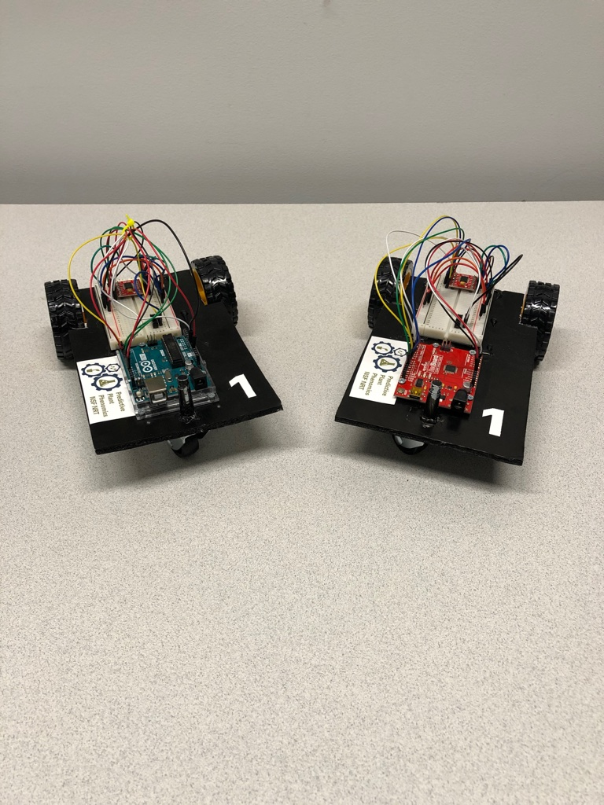

# Economical Rovers

The Economical Rovers section of the P3 Corteva sponsored workshop at Phenome2020 demonstrates how rovers have been developed by students of various educational backgrounds using low-cost and publicly aviailable materials. We have assembled the necessary code and hardware to create three rovers. 

* Overview of the rovers:
    + Rover 1 is the most simple to both build and to make mobile by executing commands on a computer that the rover is attached to by a cord.
    + Rover 2 is more complex than Rover 1, because this rover has a graduate-student constructed body and executes an uploaded pre-planned path while under battery power. 
    + Rover 3 is the most complex rover that the graduate-students have constructed with its wireless controls, prefabricated body, and upgraded hardware.

<!--
This section of workshop is focused on the use of rovers assembled using resources that can be obtained at relatively low-cost. Below you will find three different sections covering the different types of rovers that were on display at the workshop. The first section is for the smaller rover that was fed commands from a computer and then executed those commands. The second section covers the rover that had code uploaded and could execute a pre-planned path when supplied with battery power. The final section is a more advanced rover that is controlled from a controller wirelessly and has a more complex set up.
-->

The required harware, software, and code can be quickly found utilizing the sections below:

## Rover 1

In this section you can find the information to help you assemble a rover that will follow instructions fed to it from a computer.

You can find all the information for this rover here: [Rover 1 Information](./P3-Rover-1)

## Rover 2

In this section you can find the information to help you assemble a rover that you can give a preprogrammed path to execute wirelessly on battery power.

You can find all the information for this rover here: [Rover 2 Information](./P3-Rover-2)

## Rover 3

In this section you can find information about the remote controlled rover, this is a more advanced build and requires more materials.

You can find all the information for this rover here: [Rover 3 Information](./P3-Rover-3)
