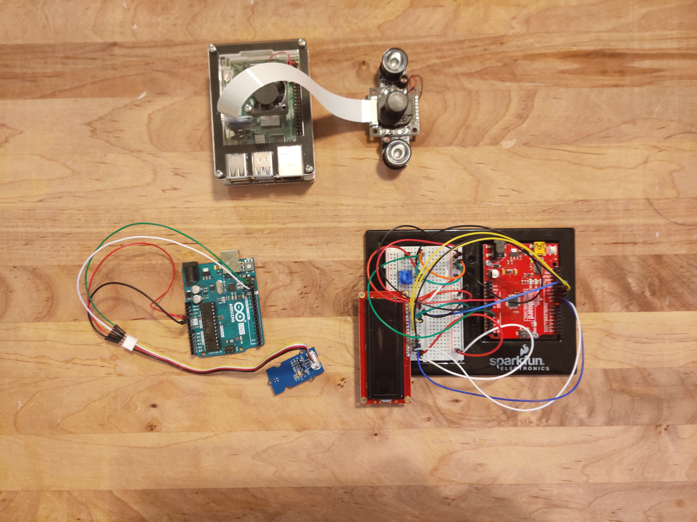

# Sensor and Camera Activity

This section compiles all of the necessary resources to recreate the RaspberryPi and Arduino 
demonstrations at the Phenome 2020 Conference by Corteva.

## Hardware
Listed below are the RaspberryPi and Arduino hardware used for our demonstration. There are many different models/flavors of these components 
for sale by both official and 3rd party retailers. These models are typically only marginally difference, and the core functionality of different models 
should remain the same. Although this set up should work with most components, we can only guarantee functionality using
the parts listed here.

* SparkFun Inventor's Kit  (https://www.sparkfun.com/products/15267)
* CanaKit Raspberry Pi 4 Kit (https://www.canakit.com/raspberry-pi)
* Arducam Low Light Sensor (https://www.arducam.com/product/arducam-m12-night-vision-ir-cut-raspberry-pi-camera/)
  * TO INSTALL CAMERA - https://thepihut.com/blogs/raspberry-pi-tutorials/16021420-how-to-install-use-the-raspberry-pi-camera
* Sensors  - soil moisture, temperature, light, pressure  (http://wiki.seeedstudio.com/Sensor/)
  * Light - http://wiki.seeedstudio.com/Grove-Digital_Light_Sensor/
  * Soil Moisture - http://wiki.seeedstudio.com/Grove-Moisture_Sensor/
  * Barometer - https://store.arduino.cc/usa/grove-barometer-sensor-bmp280
  * Temperature uses the included sensor in the SparkFun Inventor's Kit

Wiring schematics for the Arduino breadboards are available in the SparkFun Inventor's Kit, or online at the following link; https://learn.sparkfun.com/tutorials/sparkfun-inventors-kit-experiment-guide---v40)

## Software
To run the appropriate code, follow the instructions at the following links
* Installing NOOBS to RaspberryPi (https://www.raspberrypi.org/documentation/installation/noobs.md)
* Download Arduino IDE or use the Web Editor (https://www.arduino.cc/en/Guide/HomePage)

## Code
Code is provided for the following;
+ Arduino code to run the appropriate sensors and configurations shown in the demonstration.
+ Python3 scripts to use the RaspberryPi camera. Commands were issued via ssh.
+ A jupyter notebok demonstrating a possible image processing workflow. The jupyter notebook relies on the Python module "PlantCV" (https://plantcv.danforthcenter.org/)

 
