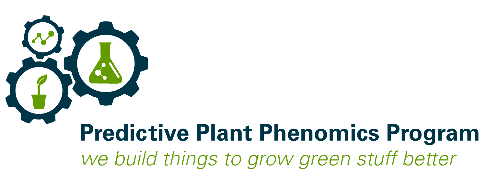
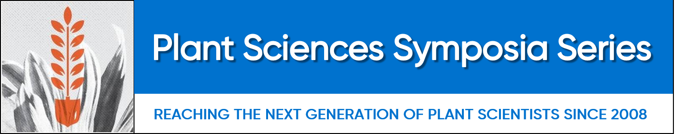

Visit our Website: [P3 NSF NRT Website](https://www.predictivephenomicsinplants.iastate.edu/)

Follow us on Twitter: [@p3iastate](https://twitter.com/p3iastate?ref_src=twsrc%5Etfw%7Ctwcamp%5Eembeddedtimeline%7Ctwterm%5Eprofile%3Ap3iastate&ref_url=https%3A%2F%2Fwww.predictivephenomicsinplants.iastate.edu%2F)

# What is the Predictive Plant Phenomics Program?

The Predictive Plant Phenomics (P3) Program is an NSF NRT at Iowa State University (ISU) that brings together students with diverse backgrounds, including plant sciences, data sciences, and engineering, and provide them with data-enabled science and engineering training. 

Our P3 specialization has provided trainees access resources such as our "Plant Cy-nce" Boxes ([P3 Cy-nce Box article](https://www.research.iastate.edu/news/p3-program-introducing-new-technology-teamwork-to-the-classroom/)) and professional development experiences including this Corteva Agriscience Plant Science Syposium Series sponsered graduate student led workshop and symposium at [Phenome2020](https://phenome2020.org/).

# Predictive Plant Phenomics Graduate Student Phenotyping Sensors Workshop at Phenome2020

## Tuesday, February 25th from 7:00 pm - 8:00 pm

This workshop will introduce attendees to various, ready-to-use sensors that can be used for collecting phenotypic data of potted plants. This activity will be led by graduate students from Iowa State University’s Predictive Plant Phenomics (P3) NSF NRT program and is sponsored by Corteva Agriscience. There will be an emphasis on hands-on building and experimenting with these economical sensors. 

# Corteva Plant Science Symposium Series, P3-Student Session: Predictive Plant Phenomics

## Wednesday, February 26th from 8:30 am - 10:00 am

* Speakers:
    + Neil Hausmann
        - Corteva Agriscience
    + Jennifer Lachowiec
        - Montana State University
    + Mahlet Anche
        - Cornell University
    + Michael Nagle
        - Oregon State University

# Funding

This material is based upon work supported by the National Science Foundation under Grant No.DGE-1545453.

National Science Foundation: [NSF P3 funding](https://www.nsf.gov/awardsearch/showAward?AWD_ID=1545453)

Plant Science Symposium Series Site: [Plant Science Symposia Series](https://www.corteva.com/our-impact/innovation/symposiaseries.html)

Corteva Agriscience Site: [Corteva Agriscience](https://www.corteva.com/)
