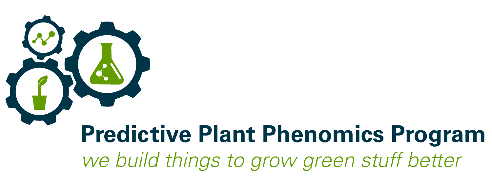

Visit our Website: [P3 NSF NRT Website](https://www.predictivephenomicsinplants.iastate.edu/)

Follow us on Twitter: [@p3iastate](https://twitter.com/p3iastate?ref_src=twsrc%5Etfw%7Ctwcamp%5Eembeddedtimeline%7Ctwterm%5Eprofile%3Ap3iastate&ref_url=https%3A%2F%2Fwww.predictivephenomicsinplants.iastate.edu%2F)

# Predictive Plant Phenomics Graduate Student Workshop at Phenome2020

## Tuesday, February 25th from 7:00 pm - 8:00 pm

P3 NSF NRT's materials for the Corteva PSSS funded student led workshop at Phenome2020.
